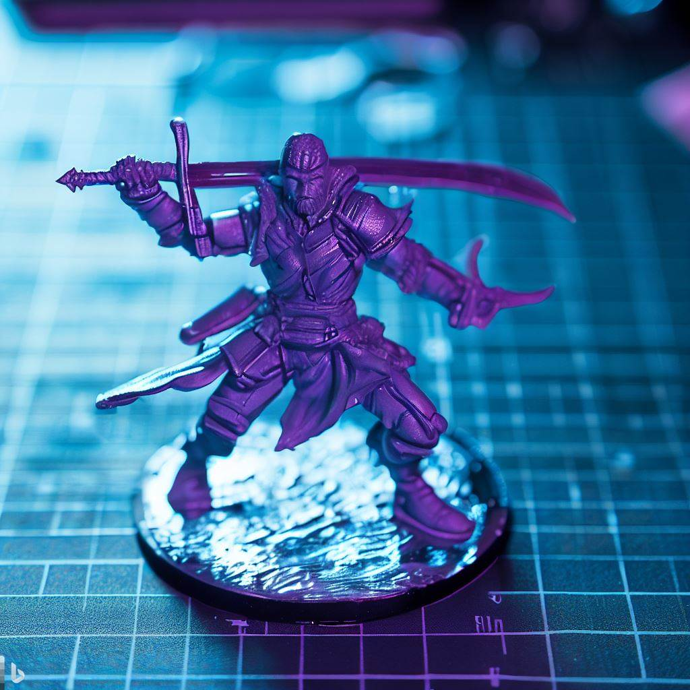

3D printing is a rapidly growing industry that has revolutionized the way we create and manufacture products. There are many different types of 3D printers available on the market today, each with its own unique set of advantages and disadvantages. Two of the most popular types of 3D printers are DLP resin printers and FDM extruder printers.

In this article, we will explore the differences between these two types of 3D printers and help you decide which one is right for you.

## FDM (Fused Deposition Modeling)

FDM printers use a melted plastic filament to create an object by layering it on a build plate. This process is relatively simple. It involves guiding a thin filament of thermoplastic through a heated nozzle/hot end. The plastic exits the nozzle and is placed on the build plate in the pattern of the part cross-section. Once a layer is complete the print nozzle moves up one layer and deposits the plastic on the previous layer until the part is complete.

FDM is a simpler technology when compared to DLP. This makes it significantly cheaper for hobbyists. There are many different rigid thermoplastics and even flexible thermoplastic polyurethanes available.

### Advantages of FDM

- Significantly cheaper than DLP 3D printers
- Wider range of material colors
- Parts can also be made to be significantly stronger than those made with DLP printers
- Can produce larger prints when compared to DLP printers

### Disadvantages of FDM

- Poor surface finish and cannot produce very fine features
- Parts have a high level of anisotropy in the z-direction. This is due to the poor interlayer bonding strength common with FDM parts.

## DLP (Digital Light Processing)

DLP printers use a UV laser to cure a vat of liquid resin into an object. Digital Light Processing (DLP), creates parts by polymerizing a liquid photopolymer resin by projecting a single UV light image of the part cross-section onto the build plate. DLP produces isotropic parts with very high levels of surface detail and resolution. It can also produce parts extremely quickly.

### Advantages of DLP

- Much faster than FDM objects
- Produce higher quality than FDM objects

### Disadvantages of DLP

- More expensive than FDM printers
- Limited range of materials available
